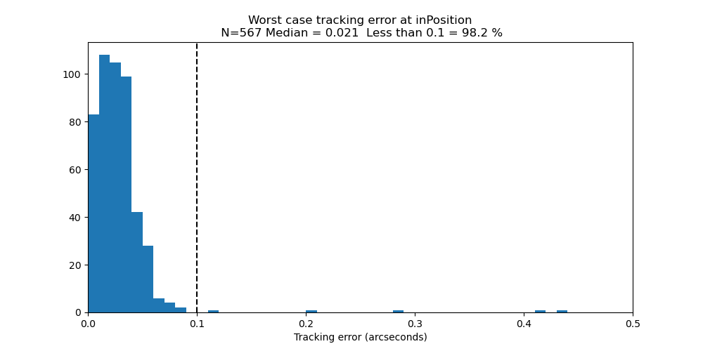
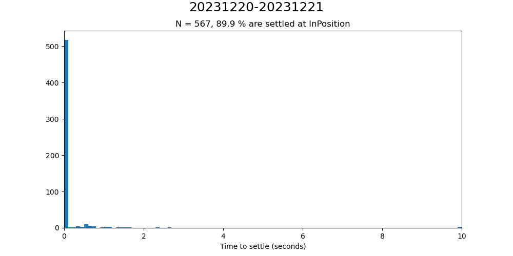

##############################################
TMA tracking jitter and settling time analysis
##############################################

Abstract
========

   Several questions have been asked about the TMA performance, including:
   
#. What is the tracking error at the InPosition timestamp?
#. How long does the TMA take to settle after the InPosition timestamp?
#. What is the RMS tracking jitter for a 15 second period after the InPosition timestamp?
#. What is the time from the beginning of a slew until the TMA is InPosition and settled?
    
This technote attempts to answer those questions.

Methodology
================
To analyze the tracking performance of the TMA, several methods were tried, as detailed in the following subsections.

Deviations from a polynomial fit
----------------------------------------------------
To analyze the mount jitter using this method, we use a procedure which has proven successful on the Auxiliary Telescope.  The telemetry data during the tracking phase is fit with a fourth order polynomial, and the jitter is defined as the deviation of the telemetry from this smooth curve. This method works and has been very successful for the AuxTel.  This method is also what was used to generate   https://sitcomtn-057.lsst.io/.  However, to get a true measure of the tracking deviations, we would like to compare the measured positions from the encoders to the demand position sent to the mount from the MTPtg CSC.  So additional methods were tried.

Demand data from MTPtg
----------------------------------------------------
The actual position of the TMA is obtained from the TMA by querying the lsst.sal.MTMount.azimuth.actualPosition and lsst.sal.MTMount.elevation.actualPosition data.  To get the demand position, the initial attempt was to query the lsst.sal.MTPtg.currentTargetStatus data.  However, since the MTMount and MTPtg are two separate CSCs, there is inevitably a timebase offset between the two.  Because of this, attempts to calculate the tracking error in this way lead to plots like Figure 1.  The tracking offset after the TMA has settled is caused by this timebase offset.  This can be subtracted off, or a timebase shift can be entered, but this introduces unwanted uncertainty in the results.

Figure 1.  Plot of a slewing event leading into a subsequent tracking event. After the TMA has stabilized, there is an offset between the demand position and the measured position caused by a timebase offset between MTMount and MTPtg.

Demand data from MTMount
----------------------------------------------------
A much better method, suggested by Tiago Ribeiro, is to obtain the demand positions by querying the lsst.sal.MTMount.azimuth.demandAz (and demandEl).  This has the advantage that all of the data is obtained from MTMount, eliminating the timebase error discussed in the previous section.  As I understand it, these are the actual demand positions which the TMA is using to drive the telescope.  Figure 2 shows that the position offset disappears with this method.  Since this is the best method known, it was used in the remainder of this technote.

Figure 2.  Plot of a slewing event leading into a subsequent tracking event. With all of the data coming from MTMount, after the TMA has stabilized, the offset between the demand position and the measured position has disappeared.

Using this method, working with Merlin Fisher-Levine, we have introduced this tracking plotting into RubinTV, so that soon each TMA tracking event will generate a plot like that in Figure 3.

Figure 3.  A typical tracking event plot.  The top panel shows the elevation and azimuth changes, the bottom plot shows the elevation and azimuth torques, and the middle plot shows the tracking errors.  There is much more discussion of the tracking errors in the following sections.

Single point errors in the tracking data stream
================================================================
Applying the method from the preceding section, we typically see a number of errors in the tracking data, where a single point of the tracking error is much larger that the surrounding points, leading to plots that look like Figure 4.

	   
Figure 4.  A tracking plot showing a number of single point errors.  These points typically show tracking errors greater than 1 arcsecond.  These cannot be physical, since it is not possible for the mount to move that fast.

I wrote JIRA ticket OBS-352 to try to understand the cause of these, but it turns out that these errors are well known and well understood.  The following quote is from Julen Garcia of Tekniker:

"Kevin is right, this is a duplicate, in fact it was covered long ago, the problem is that we have different timestamp values for each variable, but we are not allowed to send one timestamp per variable, so they are grouped together with a single timestamp, therefore an error in the timestamp of up to 50ms is possible within data for the same topic."

The cause is understood, but a fix appears not to be coming anytime soon.  Because of this, we wrote code to allow us to filter out these errors.  Basically the code looks at each data point, and if a data point is >0.1 arcseconds different from the preceding datapoint, it is replaced with an extrapolation of the preceding two points.  There is a check to prevent more that three successive datapoints from being replaced, and a counter in the plot that documents how many point were replaced.  Figure 5 shows that same plot as Figure 4 with the bad data point filter in place.  For the analysis in the following sections, the bad data point filter was set to True.

	   
Figure 5.  The same plot as Figure 4, with the bad data point filter in place.  The number of filtered datapoints is documented on the plot.

Results of the analyses
==========================================
The methods in the preceding sections were applied to approximately 500 tracking events during the nights of 2023-12-20 and 2023-12-21.  These are detailed in the following sections.

What is the tracking error at the InPosition timestamp?
-----------------------------------------------------------------------------------------
Figure 6 shows the worst case tracking error (between Az and El) at the time of the InPosition timestamp.

	   
Figure 6.  Worst case tracking error (between Az and El) at the time of the InPosition timestamp.

How long does the TMA take to settle after the InPosition timestamp?
-----------------------------------------------------------------------------------------------------
To answer this question, we need to determine what we mean by the TMA being settled.  This is not an easy question to answer, but the definition used here is that the TMA is considered settled if the RMS tracking error for the next 15 seconds is less than 0.01 arcseconds.  This definition is a little strange in that you have to look 15 seconds into the future to know if the TMA is settled, but it is what we are using.  Using this definition of the settling time, Figure 7 shows the time for the TMA to settle after the InPosition timestamp.  For most events, the TMA is settled at the InPosition timestamp.  For events which are not settled at the InPosition timestamp, a binary search is run to find how much time needs to be added after InPosition for the RMS tracking error to be less than 0.01 arcseconds. Figure 8 shows an event which is not settled at InPosition.

	   
Figure 7.  Histogram of the settling times using the algorithm described in the text.

	   
Figure 8.  An example showing an event where the TMA is not settled at the InPosition timestamp.  The vertical black dotted line is the InPosition timestamp, and the vertical green dotted line is when the TMA has settled, using the algorithm described in the text.

What is the RMS tracking jitter for a 15 second period after the InPosition timestamp?
-----------------------------------------------------------------------------------------------------------------------------------
As discussed above, the specification for the TMA requires that the RMS jitter stays below 0.01 arcseconds for a 15 seconds period after the InPosition time stamp.  How well are we doing compared to this requirement?  Figure 9 shows the results of that analysis, either starting at the InPosition timestamp, or waiting a short time before starting the 15 second period.

	   
Figure 9. RMS jitter for a 15 second period, either starting at the InPosition timestamp, or waiting a short time before starting the 15 second period.

Here I need to mention that these results are significantly better than what I showed from earlier analyses.  I believe this is because of two reasons: (1) using the MTMount as the source of the demand position instead of MTPtg, as discussed in the Methodology section, and (2) a better algorithm for screening out the bad datapoints, as discussed in the section on Single point errors in the tracking data stream.

What is the time from the beginning of a slew until the TMA is InPosition and settled?
-------------------------------------------------------------------------------------------------------------------------------------------------
The specification for the TMA requires that the TMA can perform slews with a magnitude of less than 3.5 degrees, and be in position and settled in less that 4 seconds.  How well are we doing with respect to this requirement?  Figure 10 shows that if we consider the end of the slew to be the InPosition timestamp, then we are meeting the requirement.  However, Figure 11 shows that if we consider the end of the slew when the TMA has settled as described above, the results are not quite as good.

.. image:: ./_static/Slew_Settle_Times_InPosition_20231220-20231221.png
	   
Figure 10. Slew and Settle time analysis, assuming that the end of the slew is the InPosition timestamp.

	   
Figure 11. Slew and Settle time analysis, assuming that the end of the slew is when the TMA has settled as described in the text.

Conclusions
============================

This technote makes a good start at answering the questions posed in the abstract.  More discussion and work is needed.

The plots in this technote were made with the following notebook at the tickets/SITCOM-1233 branch of notebooks_vandv.
notebooks/tel_and_site/subsys_req_ver/tma/SITCOMTN-112_SITCOM-1233_Slew_Jitter_Analysis_19Feb24.ipynb

